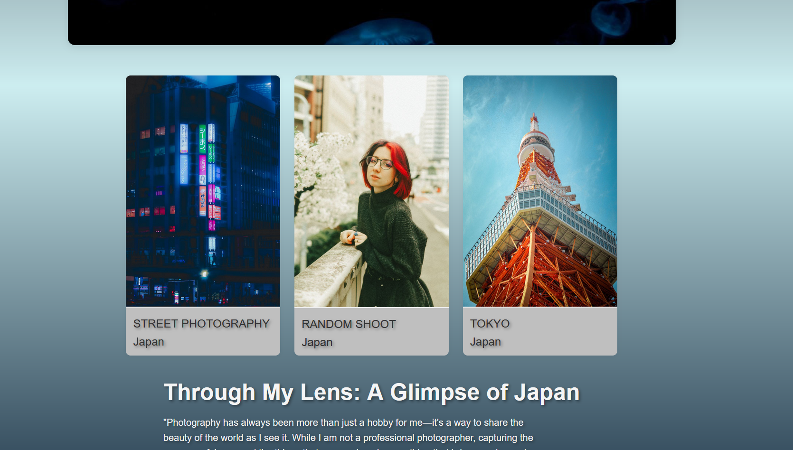
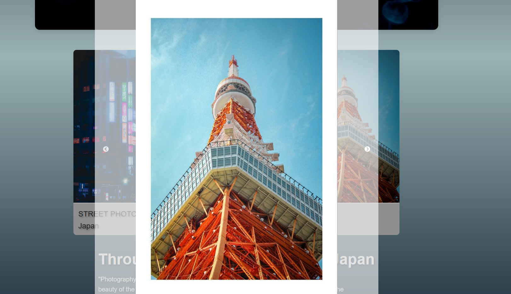

# My Photo Portfolio

This is a personal photo portfolio designed to showcase my photography, capturing the beauty of Japan and the everyday things that inspire me. While I am not a professional photographer, this project allows me to share my vision and passion for photography.

## Demo

Check out the live demo of the project here: [My Photo Portfolio](https://mi-photopage.netlify.app/)

## Features

- **Responsive Design**: Optimized for both desktop and mobile devices.
- **Category-Based Navigation**: Easily browse through different photo categories.
- **Image Slider**: A smooth and elegant image slider for selected photos.
- **Modern Aesthetics**: Clean UI with a soft color palette and animations for a pleasing user experience.

## Technologies Used

- **React**: For building a fast and modular frontend.
- **Styled Components**: To handle custom and responsive styling.
- **Netlify**: For fast and easy deployment.

## Screenshots

  

---

Feel free to explore, and don't hesitate to reach out with feedback or questions.
